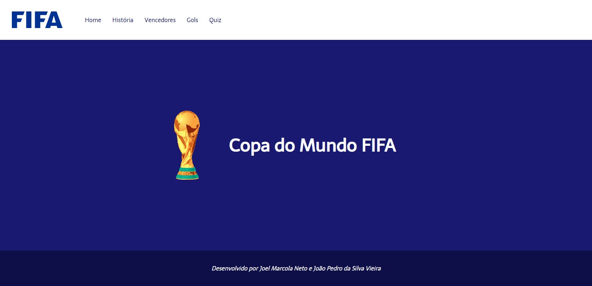
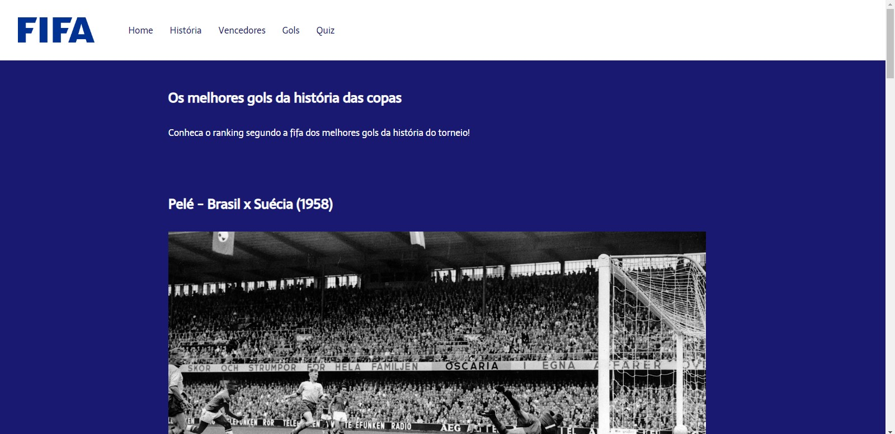
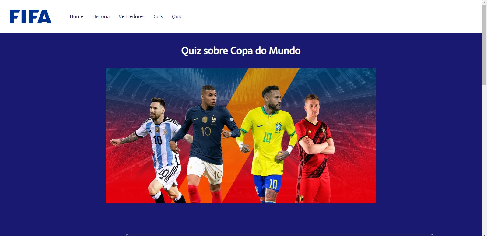

<h1 align="center">
  Copa do Mundo
</h1>

 

  

 

## **Sobre o projeto**

#### Projeto final da disciplina de Desenvolvimento Web I.

Site sobre a Copa do Mundo de futebol da FIFA. 

 

## **Páginas**

- Home
- História
- Vencedores
- Gols
- Quiz

 

## **Demonstração**

A página "gols" traz uma lista com os melhores e mais históricos gols da Copa do Mundo.

 

  

 
 

Na página "quiz", traz algumas perguntas de múltipla escolha sobre a história das Copas do Mundo.

 

  

 

## **Tecnologias utilizadas**

